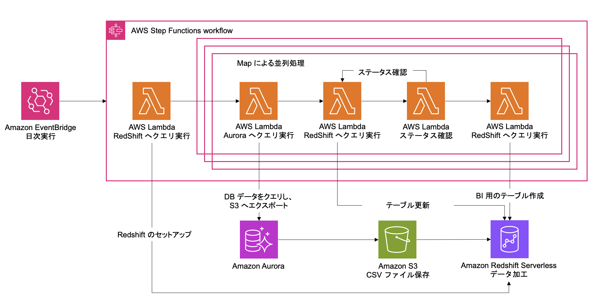

# Aurora to S3 & Redshift Serverless System

このリポジトリは、 Amazon Aurora MySQL から データウェアハウスとしての Amazon Redshift にデータを集約し、BI ツールである Amazon QuickSight で可視化する実装サンプルです。Aurora MySQL から Redshift までを AWS Cloud Development Kit (CDK) で構築し、QuickSight は マネジメントコンソールから作成します。

# Use Case

DWH Analysis System を使用して、既存のデータベースを使って データレイクとデータウェアハウスを同時にかつ簡易に構築できます。データウェアハウスである Amazon Redshift にデータを格納することで、本番環境として稼働しているデータベースに負荷をかけることなくデータ分析を行えます。
また、各テーブルに対して S3 を経由した Redshift へのデータ移行を行なっているため、ETL 処理を追加することができます。

## Use Case1

Aurora MySQL に格納されている時系列形式のデータをデータウェアハウスである Redshift にコピーして分析用途で利用したいが、一方でアプリケーションのデータベースに負荷をかけたくない場合のユースケース

## Use Case2

リアルタイムでの同期は不要で、日次や月次での定期実行で問題ないが、データは特定のテーブルを差分でコピーしたい場合のユースケース

## Use Case3

S3 に一度データをコピーすることで、ETL 処理を挟み込みたい場合のユースケース

# Architecture

このサンプルでは、Amazon EventBridge をシステム実行のスケジューラーとしています。データ集約は AWS Step Functions と AWS Lambda で構成されています。データのロード元 データベース として Amazon Aurora MySQL を使用し、Amazon S3 を経由して Amazon Redshift にデータが格納されます。


## 各ステップの概要

1. Amazon EventBridge でシステムを定期実行します。
2. EventBridge によってトリガーされた 2 の Lambda が、Redshift のセットアップを行います。
3. 2 が終わった後、3~6 は データベースに格納されているテーブルの数だけ並列実行されます。3 の Lambda がデータベースから S3 へデータをエクスポートします。
4. 4 の Lambda が、 S3 に格納された CSV ファイルを元に RedShift のテーブル更新を行います。
5. 5 の Lambda で、4 の Lambda の実行終了をチェックします。
6. 6 の Lambda が、更新された Redshift のテーブルを元に BI 用のテーブルを作成します。

# Deploy

## 1. パッケージインストール

デプロイに必要なパッケージをインストールします。プロジェクトのルート(package.json が存在するディレクトリ)にて下記実行してください。

```
npm ci
```

## 2. CDK のセットアップ

CDK のセットアップをします。 この作業は、AWS アカウントのあるリージョンで初めて CDK を利用する際に必要になります。 今回は東京リージョン(ap-northeast-1) にデプロイすることを想定しているため、以下の通り実行します。数分程度で完了します。

```
AWS_REGION=ap-northeast-1 npm run cdk bootstrap
```

## (Option1)新規の Aurora MySQL を利用する場合

デフォルトでは新規の RDS を作成するように設定してあります。テーブルの例も存在しているため、3. stack のデプロイに進むことで DWH Analysis System を試すことができます。

## (Option2) 既存の Aurora MySQL を利用する場合

既存の RDS を利用するために、以下のコマンドで設定ファイルを作成します。

```
cp config/dev_example.ts config/dev.ts
```

作成した dev.ts ファイルを修正します。

```
export const config:Config = {
    dbClusterId: "Aurora の場合は クラスター ID を、RDS の場合はインスタンス ID を入力してください",
    dbPort:"DB のポート番号を入力してください",
    dbName: "DB 名 (defaultdatabasename) を入力してください",
    dbHostname:"DB のエンドポイント名を入力してください",
    secretId: "Secrets Manager から、該当の RDS を選択してシークレット名を入力してください",
    vpcId: "RDS が配置されている VPC のID を入力してください",
    account: "AWS アカウントの ID を入力してください",
    region: "RDS が配置されている DB のリージョンを入力してください",
}
```

## 3. Stack をデプロイ

下記コマンドにて CDK スタックのデプロイを行います

```
cdk deploy --all
```

Amazon QuickSight と Redshift を接続する方法は Deployment.md を参照してください。

# FAQ

## Amazon RDS zero-ETL integrations with Amazon Redshift との違いはなんですか？

リアルタイムでの同期が不要な場合にこのシステムを構築することで、アプリケーションのデータベースに負荷をかけずに BI 用のテーブルを作成することができます。また、S3 を経由して Redshift に格納しているため、S3 から機械学習用途のデータとして活用することもできます。

# Documentation

See the [docs](docs) folder for the documentation.

# Contributing

See [CONTRUBUTING](CONTRIBUTING.md) for more information.

# Licence

This library is licensed under the MIT-0 License. See the [LICENSE](LICENCE) file.

- [構築手順書](docs/Deployment.md)
- [操作確認手順書](docs/Operation.md)
- [実装解説と本番に向けての注意事項](docs/Implementation.md)
