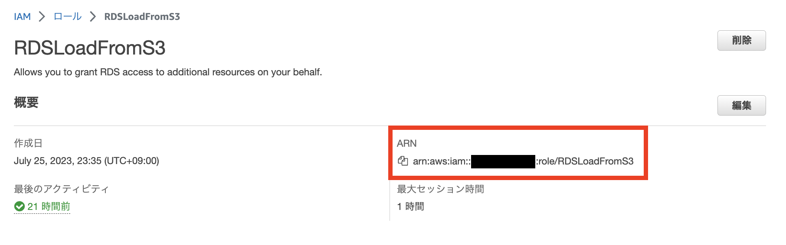
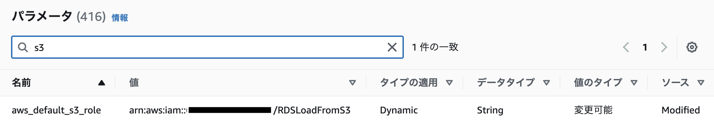
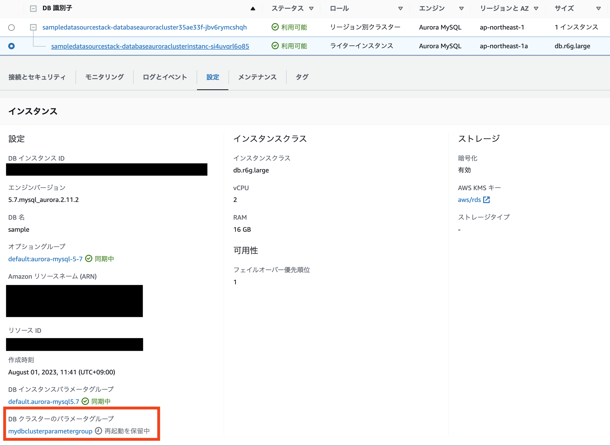

# デプロイ手順

プロトタイプをデプロイする手順を説明します。

## 想定環境

- Amazon QuickSight にて Enterprise Edition の Subscriptionがあること
- Docker
- Node.js
- AWS 認証情報の設定： `aws configure` から設定できます。[詳細はこちら](https://docs.aws.amazon.com/cli/latest/userguide/cli-configure-quickstart.html)をご確認ください

[AWS Cloud9](https://aws.amazon.com/jp/cloud9/)を利用することで環境の差異によるエラーを削減することができます。その場合、[この手順に従って](https://docs.aws.amazon.com/ja_jp/cloud9/latest/user-guide/move-environment.html) Cloud9 のストレージのボリュームサイズを50GB程度に拡張してから実行してください


## 1. パッケージインストール

デプロイに必要なパッケージをインストールします。プロジェクトのルート(package.json が存在するディレクトリ)にて下記実行してください。

```bash
npm ci
```
## 2. CDK のセットアップ

CDK のセットアップをします。
この作業は、AWS アカウントのあるリージョンで初めて CDK を利用する際に必要になります。
今回は東京リージョン(ap-northeast-1) にデプロイすることを想定しているため、以下の通り実行します。数分程度で完了します。

```bash
AWS_REGION=ap-northeast-1 npm run cdk bootstrap
```

## (Option1) 新規の RDS を利用する場合

デフォルトでは新規の RDS を作成するように設定してあります。テーブルの例も存在しているため、[3. Stackをデプロイ](## 3. Stackをデプロイ) に進むことで DWH Analysis System をお試しいただけます。


## (Option2) 既存の RDS を利用する場合

既存の RDS を利用するために、以下のコマンドで設定ファイルを作成します。
```bash
cp config/dev_example.ts config/dev.ts
```

作成した dev.ts ファイルを修正します。
```typescrpt
export const config:Config = {
    dbClusterId: "Aurora の場合は クラスター ID を、RDS の場合はインスタンス ID を入力してください",
    dbPort:"DB のポート番号を入力してください", 
    dbName: "DB 名 (defaultdatabasename) を入力してください",
    dbHostname:"DB のエンドポイント名を入力してください",
    secretId: "Secrets Manager から、該当の RDS を選択してシークレット名を入力してください", 
    vpcId: "RDS が配置されている VPC のID を入力してください",
    account: "AWS アカウントの ID を入力してください", 
    region: "RDS が配置されている DB のリージョンを入力してください",
}
```


## 3. Stackをデプロイ

下記コマンドにて CDK スタックのデプロイを行います

```bash
cdk deploy --all
```

## 4. AuroraからS3 Bucketにファイルを出力するためのIAMロールを作成及び権限付与

以下1-5の手順については[Amazon Web Services ブログ](https://aws.amazon.com/jp/blogs/news/best-practices-for-exporting-and-importing-data-from-amazon-aurora-mysql-to-amazon-s3/)や[Aurora のユーザーガイド](https://docs.aws.amazon.com/ja_jp/AmazonRDS/latest/AuroraUserGuide/AuroraMySQL.Integrating.LoadFromS3.html)でも紹介されているため、そちらもご確認ください。

1. IAMポリシーを新規作成します。(Ex.ポリシー名：`AllowAuroraToBucket`) Json形式の欄に以下をコピー&ペーストし、`example-bucket`をStack内で作成したバケット名に変更します。

```json
{
    "Version": "2012-10-17",
    "Statement": [
        {
            "Effect": "Allow",
            "Action": [
                "s3:GetObject",
                   "s3:AbortMultipartUpload",
                   "s3:DeleteObject",
                   "s3:ListMultipartUploadParts",
                   "s3:PutObject",
                   "s3:ListBucket"
            ],
            "Resource": [
                "arn:aws:s3:::example-bucket/*",
                "arn:aws:s3:::example-bucket"
            ]
        }
    ]
}
```

2. ロールを新規作成（信頼関係を下記）し、作成したIAMアタッチします。（Ex.ロール名：`RDSLoadFromS3`）
  * [ ロール ] を選択します。 
  * [ ロールを作成 ] を選択します。
  * [AWS のサービス] で [RDS] を選択します。
  * [ユースケースの選択] で [RDS - データベースへのロールの追加] を選択します。
  * [Next] を選択します。
  * [アクセス許可ポリシーのアタッチ] ページで、[検索] フィールドに上記で作成したポリシーの名前を入力します。
  * [ロール名]にロールの名前を入力し、ロールを作成します。


作成したロールのARNをメモしておきます。（Ex.`arn:aws:iam::XXXXXXXXX:role/RDSLoadFromS3`）



3. AWS コマンドラインインターフェイス（AWS CLI）からDBクラスターのパラメータグループの作成します。
   今回の例では、Aurora MySQL 8.0 のカスタムパラメータを作成しています。

   既存のRDS を使っていてカスタムクラスターパラメータグループが存在する場合は、以下の スクリプト実行は不要です。既存のカスタムクラスターパラメータグループをお使いください。

```bash
aws rds create-db-cluster-parameter-group \
    --db-cluster-parameter-group-name mydbclusterparametergroup8 \
    --db-parameter-group-family aurora-mysql8.0 \
    --description "My new cluster parameter group"
```

1. パラメータグループ内のaws_default_s3_roleにロールのARN値をコピーします。
  1. AWS RDSのマネジメントコンソールを開きます。
  2. 左側のナビゲーションバーからパラメータグループを選択します。
  3. デフォルトのパラメータグループを選択します。
  4. タイプ: DBクラスターパラメータグループのパラメータ（Ex.`mydbclusterparametergroup8`）をクリックし、パラメータ(`aws_default_s3_role`)を編集します。
     1.  MySQL のバージョンによって必要なパラメータが異なります。こちらの[リンク](https://docs.aws.amazon.com/ja_jp/AmazonRDS/latest/AuroraUserGuide/AuroraMySQL.Integrating.Authorizing.IAM.AddRoleToDBCluster.html)をご参照ください。





1. 作成したDBクラスターパラメータグループとDBクラスターの関連付け

* 作成したDBを選択し、[ 接続とセキュリティ ]タブを選択し、IAMロールの管理から先ほど作成したIAMロール（Ex.ロール名：RDSLoadFromS3）を追加する。
* [ 設定 ]タブを選択し、[ 変更 ]ボタンをクリック。
* [ 追加設定 ]の[ DBクラスターパラメータグループ ]から作成したパラメータグループを選択し, [ 続行 ], `すぐに適用`を選択し[ DBインスタンスを変更 ]をクリックします。（Ex. mydbclusterparametergroup）


* 作成したDBクラスターパラメータグループとDBクラスターの関連付けした後、以下の画像の様に`再起動を保留中`になっている場合は、画面右上の`アクション`から再起動を行ってください。


## 5. Databaseを初期化

* [AWS Lambdaのマネジメントコンソール](https://ap-northeast-1.console.aws.amazon.com/lambda/home)を開き、検索用テキストボックスに`seeder`と入力して検索してください。Lambda関数が一つだけ検索されますので、選択して詳細を表示してください。

* 画面を下にスクロールし、`Test`タブを開いて、`Event JSON`に下記のようにJSONを入力し、右上の`Test`ボタンをクリックしてください。これにより、メタデータを管理するデータベースに`CREATE DATABASE`と`CREATE TABLE`文を発行しDBを初期化します。
  ```json
  {
    "command": "init"
  }
  ```

* 上記のコマンドが正常に終了した後、`Event JSON`に下記のようにJSONを入力し、右上の`Test`ボタンをクリックしてください。これにより、メタデータを管理するデータベースの各テーブルに`INSERT`文を発行しDBにサンプルデータを準備します。
  ```json
  {
    "command": "seed"
  }
  ```


## 6. Redshiftをテーブル定義

* [AWS Lambdaのマネジメントコンソール](https://ap-northeast-1.console.aws.amazon.com/lambda/home)を開き、検索用テキストボックスに`init`と入力して検索してください。Lambda関数(Ex.`AnalysisSystemStack-WorkFlowRedshiftInitXXXXX`)が一つだけ検索されますので、選択して詳細を表示してください。

* 画面を下にスクロールし、`Test`タブを開いて、`Event JSON`に下記のようにJSONを入力し、右上の`Test`ボタンをクリックしてください。これにより、Redshiftに`CREATE TABLE`文を発行し、テーブルを定義します。※完了するまで数分かかる場合があります。
  ```json
  {
    "command": "init"
  }
  ```


## 7. QucikSightにRedshiftのテーブルデータへのアクセス許可


1. QuickSightからVPCに接続するためのロールを作成します。[詳細なリンク](https://docs.aws.amazon.com/ja_jp/quicksight/latest/user/vpc-creating-a-connection-in-quicksight-console.html)
1. QuickSight用のセキュリティーグループを作成します。[詳細なリンク](https://repost.aws/ja/knowledge-center/quicksight-redshift-private-connection)


2. QuickSightのアカウントを作成し、右上の人物マークから[ QuickSightの管理 ] → 左側の[ VPC接続の管理 ] → [ VPC接続の追加 ]を選択する。入力項目に従い、VPCの接続を追加します。[ 実行ロール ], [ セキュリティグループID ]には、前工程で作成したロールとセキュリティグループを指定します。接続完了するまで数分かかります。


## Appendix. Clean up

検証が終わり、リソースが不要になりましたら下記手順およびコマンドから削除してください。いくつかのリソースが削除しきれずに残ってしまう可能性がございます。
その場合は手動で削除いただくようにお願いいたします。

1. 7.で作成したセキュリティグループを削除

2. デプロイしたStackを削除
```bash
cdk destroy --all
```

