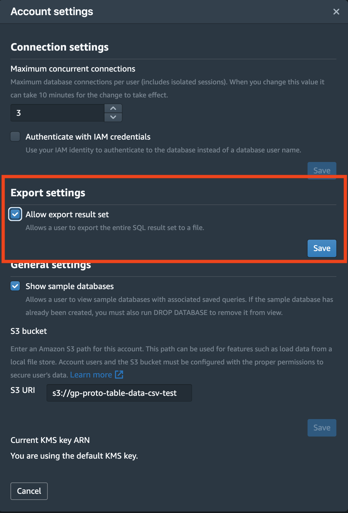

# 実装解説

ここでは各実装のポイントについて解説いたします。今後カスタマイズをどのように行うかのヒントなどにご利用ください。

# プロトタイプのファイル構成

```
root
├── bin/                            // CDKアプリケーションのエントリポイント
├── docs/                           // ドキュメント
├── lambda/                         // AWS Lambda関数のソースコード
│   ├── auroraloadkicker/           // DBからS3にcsvファイルを保存するLambda関数
│   ├── redshiftanalysistable/      // QuickSightに表示する集計テーブルを作成するLambda関数
│   ├── redshiftinit/               // Redshiftのテーブルを作成するLambda関数
│   ├── redshiftloadkicker/         // S3のcsvファイルをRedshiftのテーブルにmergeするリクエストを投げるLambda関数
│   ├── redshiftloadwaiter/         // リクエストの状態を監視するLambda関数
│   └── seeding/                    // DBのテーブルを作成/削除するLambda関数
├── lib/                            // インフラストラクチャをTypescriptで実装したスクリプト
├── .gitignore                      // gitのトラッキングを設定するファイル
├── .npmignore                      // npmのトラッキングを設定するファイル
├── .prettierrc                     // prettierの設定ファイル
├── README.md                       // ドキュメントの各ページへのリンクを含む目次
├── cdk.json                        // CDKの設定ファイル
├── package-lock.json               // プロトタイプをビルド、デプロイするためのpackage-lock.json
├── package.json                    // プロトタイプをビルド、デプロイするためのpackage.json
└── tsconfig.json                   // TypeScriptの設定ファイル

```

# アーキテクチャ


# 実装のポイントと注意事項

## CDK

このプロトタイプは[AWS CDK](https://docs.aws.amazon.com/cdk/index.html)を用いて開発されています。もし知見がない場合、[こちらのハンズオン](https://cdkworkshop.com/ja/20-typescript.html)により一通りの学習が可能です。このハンズオンをある程度完了させたら、[API リファレンス](https://docs.aws.amazon.com/cdk/api/v2/docs/aws-construct-library.html)を参照して開発を行ってください。プロトタイプを理解するためのソースコードリーディングにおいても、[CDK のエントリポイント](../bin/analysis-system.ts)からスタートすることをお勧めします

## CDK/CloudFormation によるリソース削除について

プロトタイプであるため開発の容易性を優先しており、S3 Bucket、Redshift、Aurora など、データを格納するリソースも含めて、原則として `cdk destroy`コマンドにより削除される設定(RemovalPolicy など)としています。本番運用時には万が一の場合を考慮して、データを保持するリソースについては`cdk destroy`実行時でも削除されない設定を行うことも可能です。ご検討ねがいます

## SampleDateSourceStack について

- プロトタイプで作成/使用したデータについてはサンプル（ダミー）データになります。本番 DB で使用されているテーブル名、データ型、カラム名に合わせて`lambda/redshiftinint/loadscripts`、`lambda/redshiftloadkicker/loadscripts`、`lambda/redshiftanalysistable/loadscripts`内のそれぞれの SQL 文を追加/編集してください。
- プロトタイプを本番環境に適用する際、SampleDataSourceStack をコード中から削除し、AnalysisSystemStack のみデプロイしてください。加えて AnalysisSystemStack 内に SampleDataSourceStack から渡される DB 引数を本番 DB に値に変更ください。構築手順中で作成した Aurora から S3 へのアクセス権を持つ role（Ex.`RDSLoadFromS3`）とパラメータグループ（Ex.`mydbclusterparametergroup`）を同様の方法で本番 DB に追加してください。

## Aurora MySQL から S3 へ保存されるデータについて

`/lambda/auroraloadkicker/index.py`から Aurora へ SQL を投げた後は、Aurora から直接 S3 へデータが保存されます。本番環境で`init`を使用する際は、数千〜1 億レコードのデータがあるかと思います。その際、処理が完了するまでに Lambda の最大起動時間 15 分を超える可能性があるため、SQL を直接 DB で実行するか、Lambda から SQL を投げる際にデータの期間を指定し、データを複数回に分ける事が望ましいと思います。
[参考リンク](https://aws.amazon.com/jp/blogs/news/best-practices-for-exporting-and-importing-data-from-amazon-aurora-mysql-to-amazon-s3/)
※プロトタイピングのコードを使用し、数回に分けてデータを取得される際は、プログラムの拡張が必要になります。

- SQL を直接 DB で実行する場合
  1. [ 構築手順書 ]で作成されたロールとパラメータグループを DB に追加する
  2. DB へ接続し、初回のみ以下の SQL を実行する
     - Aurora MySQL version 3 をご利用の場合
       ```sql
       GRANT AWS_SELECT_S3_ACCESS TO <user名>@<domain-or-ip-address>;
       ```
     - Aurora MySQL version 2 をご利用の場合
       ```sql
       GRANT SELECT INTO S3 ON *.* TO <user名>@<domain-or-ip-address>;
       ```
  3. 指定のテーブルを S3 へ保存する SQL を実行 ※必要に応じて変数や値を変更ください。
     ```sql
     SELECT * FROM <TABLE>
     INTO outfile S3 's3://<BUCKET_NAME>/<FOLDER_NAME>/<TABLE>/<TABLE>.csv'
     FORMAT CSV HEADER
     FIELDS TERMINATED BY ','
     LINES TERMINATED BY '\n'
     MANIFEST ON OVERWRITE ON;
     ```

## Amazon EventBridge のスケジューリングについて

プロトタイプでは深夜 1:00 にワークフローが実行されるように設定していますが、今後の運用に応じて実行間隔を適宜変更ください。CDK を使った EventBridge では、実行を行う日時を指定する場合、UTC で設定する必要があるためご注意ください。時間間隔に応じた定期実行(Ex. 3 時間毎)も可能です。詳細はこちらの[リンク](https://docs.aws.amazon.com/cdk/api/v2/docs/aws-cdk-lib.aws_events.Schedule.html)を参考に CDK を修正ください。その際は合わせて QuickSight のデータセット更新のスケジュール設定も変更する必要があります。

## Redshift Severless について

- あらかじめ Redshift 内にからのテーブルを作成した上で、指定された CSV 分のデータを merge する様にしています。
  最終的に集計結果のテーブルについては、期間指定の実装しておりませんので、必要の際は lambda 関数の python コードおよび SQL を修正ください。また複数の分析に応じてテーブルを分ける場合、テーブル作成スクリプト（/redshiftinit 内）も同様に追加/修正ください。
- StepFunctions 内の最初に Redshift へのクエリ実行し、10 分待機している理由は、Redshift Serverless のエラーによる StepFunctions の失敗を回避するためです。現在 Redshift Severless において長時間（一時間以上）クエリを実行していない状態のままクエリ実行をすると、初回のクエリのみ internal error が発生する仕様になっており、その影響で日次実行される StepFunctions のプロセスを止めないためにダミーのクエリをはじめに実行しております。

- イレギュラーな分析や CSV ファイルを出力する必要が発生した場合

  - Redshift のマネージメントコンソールの左側のナビゲーションバーから[ クエリエディタ v2 ]を選択すると Redshift 内でクエリを直接叩くことができます。※初回起動時はリソースを暗号化するために使用する AWS KMS key の作成または選択をする必要があります。詳細な手順は[こちらのリンク](https://docs.aws.amazon.com/ja_jp/redshift/latest/mgmt/query-editor-v2-getting-started.html)をご参考に設定してください。

- 作成したテーブルデータを Export する際、エディターから許可設定しないと起こるエラーとその解決策を以下に示します。

  - エラー:「Exporting result sets is disabled for this account.」
    

  - 解決策:クエリエディタ v2 の画面左下の[ 歯車マーク ]をクリックし、表示されたポップアップの[ Export settings ]の[ Allow export result set ]のチェックボックスを選択し、[ Save ]してください。
    

## QuickSight について

今後の運用でグラフ表示や他の機能を使った分析を行われる際は、[QuickSight の workshop](https://catalog.workshops.aws/quicksight/en-US/author-workshop)を参考にご活用ください。分析のテンプレートが決まり、ダッシュボードとして社内外に公開される際、方法やアクセス権の付与など[こちらのリンク](https://docs.aws.amazon.com/ja_jp/quicksight/latest/user/sharing-a-dashboard.html)をご参考ください。
また CDK を使った QuickSight の実装はコード数が膨大になり、複雑になるためオススメしておりません。

## セキュリティについて

御社のセキュリティーポリシーに準じて各サービスの設定をお願い致します。
