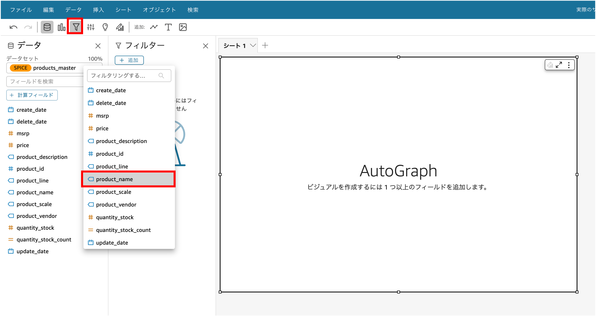

# 動作確認手順

ここでは動作確認手順をご紹介します

## 1. 日次実行

特に入力して頂くものはありません。
EventBridgeがすでにデプロイされており、日本時間01:00AM(深夜1時)に前日分のデータがS3に出力され、Redshiftのテーブルに反映されます。日々のログはAWS Step FunctionやAmazon CloudWatchからご確認ください。


## 2. 過去のレコードを全件取得

AWS Step Function マネージメントコンソールを開き、左側のナビゲーションバーから[ ステートマシン] を選択し、`makeTableWorkFlow`の名前をクリックし、その後表示される[ 実行 ]タブを選択。右側に表示されるオレンジの[ 実行を開始 ]ボタンをクリック。入力部に記入されている`{ "Comment": "Insert your JSON here" }`を削除し、下記の値をコピーした後、実行を開始をクリックする。※`user`、`domain-or-ip-address`はAmazon Aurora MySQLでデータをロードするための権限の付与するためにDBのuser名、domain名またはipアドレスを指定します。本プロトタイプの検証では変更する必要はございませんが、今後の本環境で実行する際は適宜変更ください。

```json
{
  "Mode": "init",
  "Term": "all",
  "Day": "all",
  "user": "admin",
  "domain-or-ip-address": "%",
  "waitSeconds": 600,
  "bucket_list": [
    "products_master",
    "orders_master",
    "order_details_master"
  ]
}
```


## 3. 特定の日付に対してレコードを取得

2.と同様の手順で下記の値で`"日付"`部分を指定したい日付（ハイフンなし形式 `Ex. 20220101`）し、[ 実行を開始 ]をクリックする。※`user`、`domain-or-ip-address`はAmazon Aurora MySQLでデータをロードするための権限の付与するためにDBのuser名、domain名またはipアドレスを指定します。本プロトタイプの検証では変更する必要はございませんが、今後の本環境で実行する際は適宜変更ください。

```json
{
 "Mode": "init",
 "Term": "specific", 
 "Day": "<日付>",
 "user": "admin",
 "domain-or-ip-address": "%",
 "waitSeconds": 600,
  "bucket_list": "<テーブルの名前の配列>"
 }
```

# Amazon QuickSightの画面操作方法 [参考リンク](https://catalog.workshops.aws/quicksight/en-US/author-workshop)

### データセットの読み込み

1. QuickSightのホーム画面を開き、左側の[ 分析 ]を選択してください。選択後、右上に表示される[ 新しい分析 ]を選択してください。


2. 画面左上の[ 新しいデータセット ]を選択してください。


3. `Redshift(手動接続)`を選択してください。

4. 表示されてる入力フォームに情報を入力し、[ 接続を検証 ]をクリックした後、問題なければ、[ データソースを作成 ]をクリックします。

    * `データソース名`：わかりやすい名前をつけることをオススメします。
    * `接続タイプ`：構築手順書内で設定したVPCを選択します。
    * `データベースサーバー`：Redshiftマネージメントコンソール左側のナビゲーションバーから[ ワークグループの設定 ]を選択 → 作成したワークグループ（Ex.`anaylsissystem`）を選択 → [ 一般的な情報 ]内のエンドポイント（Ex. `analysissystem.XXX...amazonaws.com`まで）
    * `ポート`：5439
    * `データベース名`：作成したRedshift内のデータベース名（Ex. `analysissystem`）
    * `ユーザ名`：AWS Secrets Managerのマネージメントコンソール左側のナビゲーションバーから[ シークレット ] → `WorkFlowRedshiftXXXXX`を選択 → シークレットの値の右端にある[ シークレットの値を取得する ]をクリックします。表示されるusernameのシークレット値を入力します。
    * `パスワード`：上記を同様。passwordのシークレット値を入力します。


### 分析画面の操作方法
1. 行数のカウントカラム追加（決済数、店舗数で使用。カウントしたいカラム毎に同様の操作を行います）
    1. 画面左上の[ データ ]ボタンを選択 → [ 計算フィールドを追加 ]を選択します。
    

    2. `名前を追加`と以下のコマンドを入力し、保存します。
        * `名前を追加`：わかりやすい名前をオススメします。
        * コマンド
        ```
        count(カウントしたいカラム名を一つ指定。Ex. point, shop_id)
        ```
        


2. フィルター追加（地域通貨の名称フィルター）
    1. 分析画面左側にある[ フォルター ]を選択 → [ フィルターを追加 ]クリックし、[ product_name ]を選択します。
    

    2. 追加したフィルターの適用先を[ このデータセットのすべてのビジュアル ]を選択します。
    

    3. 作成したフィルターを[ シートに追加 ]を選択します。
    

3. 表の作成方法
    1. 画面左上の[ 挿入 ]ボタンを選択 → [ ビジュアルの追加 ]を選択します。
    

    2. 画面左下の[ ビジュアルタイプ ]から[ ピボットテーブル ]を選択します。
    

    3. `行`だったらグラフ表示画面の左側に、`列`だったら上部に,`値`だったら中央の枠内に[ フィールドリスト ]内のカラム名をドラック&ドロップします。
        * 作成前
        

        * 作成後
        
    4. 表のタイトルの編集は、表の右上にある[ 鉛筆マーク ] を選択 → 右側に表示される[ プロパティ ] → [ タイトルを編集 ]から編集します。
    


### データセットの更新 [参考リンク](https://docs.aws.amazon.com/ja_jp/quicksight/latest/user/refreshing-imported-data.html)
本番ではRedshiftのテーブルが日次で更新されるため、QuickSight側のテーブルも更新を行う必要があります。
1. QuickSightのホーム画面左側から[ データセット ]を選択し、Redshiftからデータを読み込んだデータを選択します。
2. [ 更新 ]タブを選択し、[ 新しいスケジュールの追加 ]ボタンをクリックします。
3. [ 増分更新 ]を選択し、タイムゾーン、開始時刻、頻度を設定します。
4. [ 増分プロパティの設定 ]から[ 日付の列 ]、[ ウィンドウサイズ(数値/単位) ]、を入力し、スケジュールを保存します。
